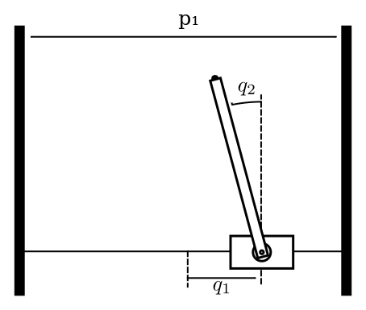
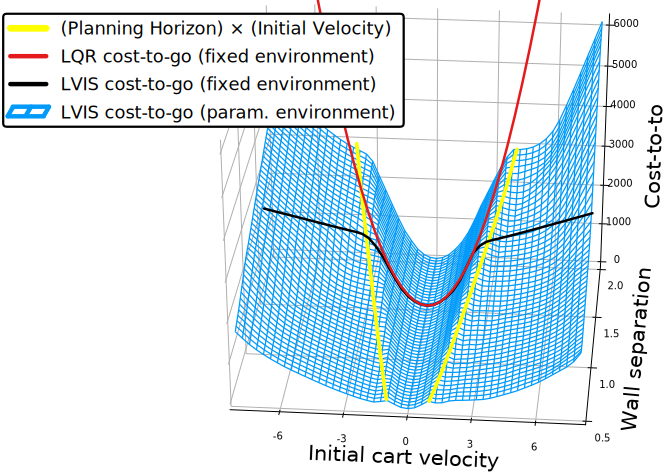

<style type="text/css">
.reveal ul {
    font-size: smaller;
}
</style>

### Learning controllers from offline global optimization by sampling value function intervals

Robin Deits, Twan Koolen, Russ Tedrake

MIT CSAIL, Robot Locomotion Group

May 23, 2019

----

### Motivation

* Can we build contact-aware controllers, capable of making decisions about when to make and break contact?
* Can we use tools from global optimization to avoid getting trapped in local minima at runtime?
* Can we create controllers that react to disturbances by using all of the contacts available to them, rather than just stepping?

----

### Abstract

* We can write down and solve mixed-integer trajectory optimization problems to plan multi-contact behaviors for walking robots.
* Unfortunately, these optimization problems are too slow to be solved online when reacting to disturbances.
* Instead, by *partially* solving a large number of mixed-integer trajectory optimizations ahead of time, we can train a neural net to approximate the value function (cost-to-go) of the optimal controller.
* This approximate value function can be used along with a much simpler online optimization to control the robot while still making useful contact decisions.

----

### Control Through Contact

* Control through contact is difficult because it requires an explicit choice between vastly different system dynamics.


----

### Control Through Contact

* Why is this hard?
    * Existing robust tools like LQR assume a single, linear dynamics
    * Contact events create discontinuities in the dynamics and violate that assumption
    * Even planning dynamic motions with contact is difficult
        * Contact-implicit trajectory optimization [1]
        * Trajectory optimization with centroidal dynamics [2]
        * Mixed-integer trajectory optimization [3]

<p>
<div style="text-align: left; font-size: 16pt">
[1] Posa et al. A direct method for trajectory optimization of rigid bodies through contact. IJRR, 2013.<br>
[2] Dai et al. "Whole-body motion planning with centroidal dynamics and full kinematics." ICRA, 2014.<br>
[3] Valenzuela. Mixed-integer convex optimization for planning aggressive motions of legged robots over rough terrain. 2016.
</div>
</p>

----

### Existing Approaches

* Differential Dynamic Programming / Iterative LQR
    * Efficient nonlinear trajectory optimization
    * Todorov, Neunert, Giftthaler, Carius, Farshidian, and others
* Computing the contact schedule ahead of time
    * Marcucci, 2017: finding a library of feasible, stable mode sequences by solving mixed-integer programs ahead of time
    * Hogan, 2017: training a classifier to predict mode sequences by solving mixed-integer programs ahead of time
* Finding a stabilizing Lyapunov function
    * Han, 2017: stabilizing policies with Linear Matrix Inequalities
* Explicit hybrid MPC
    * Bemporad and others
* Approximations of explicit MPC
    * Chen, 2018: "Approximating Explicit Model Predictive Control Using Constrained Neural Networks"

----

### Inspiration: Footstep Planning

<video data-autoplay src="static/video/MIT_VRC_Summary_trimmed.m4v" height="450" controls >
</video>

<div style="font-size: 12pt">Tedrake et al. "A Summary of Team MIT’s Approach to the Virtual Robotics Challenge". ICRA 2014.</div>


----

### Why is Footstep Planning Hard?

* Optimization around obstacles is hard, and tends to result in poor-quality local optima when the solver gets trapped on the wrong side on an obstacle:


----

### Optimal Mixed-Integer Footstep Planning

* Instead, what if we:
    * Decompose the obstacle-free space into convex pieces
    * Require that every footstep pose must be assigned one of those safe convex pieces
    * Optimize over the pose of each footstep *and* its assignment simultaneously as a mixed-integer program

----

### Convex Decomposition

<div style="flex-direction: row">
    
    
</div>
<br>

----

### Globally Optimal Mixed-Integer Footstep Planning

* If we have all of these:
    * Convex cost function
    * Convex constraints (such as being contained in a convex region)
    * Integer (discrete) variables (choice of which convex region to use for each foot)
* Then we have a Mixed-Integer Convex Program, which we can solve to global optimality with commercial solvers (Mosek, Gurobi, CPLEX, etc.)
    * We can simultaneously solve for both the continuous positions of each footstep and their discrete assignments to safe regions in a single optimization
    * But it gets harder with more integer variables

----

### Mixed-Integer Footstep Planning

<video data-autoplay src="static/video/terrain.mp4" height="450" controls />
</video>

<div style="font-size: 14pt">Drake: A planning, control, and analysis toolbox for nonlinear dynamical systems. <a href="https://drake.mit.edu">https://drake.mit.edu</a></div>

----

### Mixed-Integer Footstep Planning

<video data-autoplay src="static/video/continuous_walking.mp4" height="450" controls />
</video>

<div style="font-size: 14pt">Maurice Fallon et al. "Continuous humanoid locomotion over uneven terrain using stereo fusion". Humanoids 2015.</div>

----

### Discussion

* Motion planning via mixed-integer programming allows us to find global optimality in cases where we might otherwise have to settle for local optimality.
* But these optimizations are exponential in time (in the worst case), so we have had to limit ourselves to offline planning.

----

### Limitations of Planning

<div style="display: flex; flex-direction: column; height: 100vh">
    <div style="vertical-align: middle;">
        <video data-autoplay src="static/video/egress.mp4" controls height="250px" >
        </video>
    </div>
    <div>
        
        <div style="font-size: 10pt;">Photo: DARPA</div>
    </div>
</div>

----

### Control Through Contact


* Can we take the idea of global mixed-integer optimization and use it to build *controllers* instead of slow offline planners?

----

### Approach: MPC

* We’ll describe our problem in the language of Model-Predictive Control:
    * Choose the robot’s state and action over the next N time steps...
        * ...to optimize some cost over state and action...
        * ...subject to the robot’s dynamics...
        * ...and respecting state and action constraints
    * Apply the optimal action for a single time step
    * Repeat the optimization

----

### MPC Details

* Most hybrid MPC work assumes that our system is *explicitly* hybrid:
    * $\dot{x} = A_i x + B_i u, \quad x \in X_i, u \in U_i \quad i \in 1, \dots, N $
* Instead, we will use a contact-*implicit* formulation with complementarity conditions (Stewart & Trinkle, 2000):
    * $\phi \geq 0 \perp f \geq 0$ for separation $\phi$ and contact force $f$
        * $\phi \geq 0$
        * $f \geq 0$
        * $\phi = 0 \~\text{OR}\~ f = 0$
* No explicit $A_i$ for each mode, instead modes are indicated by which side of each complementarity condition is zero
    * Similar to Michael Posa's contact-implicit trajectory optimization, but modeling complementarity as hard binary constraints

----

### MPC Details

* For each complementarity condition $\phi \geq 0 \perp f \geq 0$, we will add a single binary decision variable to determine which variable is constrained to zero
* I developed `ConditionalJuMP` to handle this process automatically, allowing statements like:
```julia
@disjunction(model, separation_from_obstacle == 0, contact_force == 0)
```
to be converted into the appropriate mixed-integer constraints.

----

### Approach: Mixed-Integer MPC

* We will model our robot’s dynamics as linear and use a quadratic cost function
    * Instead of a discrete choice among safe regions, we will make a discrete choice for each complementarity condition
* This lets us write down the MPC optimization as a Mixed-Integer Quadratic Program (MIQP)
    * The branch-and-bound algorithm can solve MIQP optimizations to *global optimality*...
    * ...although this can potentially take an extremely long time
* Branch-and-bound iterates between finding better solutions and finding tighter bounds on the best solution, so we can also terminate it early and get a sub-optimal result.

----

### Optimization Ahead-of-Time

* What if, for a particular environment, we could solve enough difficult mixed-integer MPC problems ahead of time and learn the resulting policy from those examples?
    * Essentially an approximation of the hybrid explicit MPC approach, or an equivalent to Guided Policy Search
* Advantages:
    * Online control would become trivial (essentially a lookup table)
    * Piecewise affine structure of the true solution can make learning easier
* Disadvantages:
    * Sampling in high-dimensional space is hard (but DAgger can help)
    * Actually solving the mixed-integer MPC problems to global optimality can take minutes or even hours <it>per sample</it>

----

### Learned Policy: Cart-Pole

<video data-autoplay src="static/img/cart-pole-net-half-speed.ogv" height="500" controls>

----

### Limitations

* The idea of learning an explicit MPC policy fell apart for robots with more than just one contact.
    * Solving each individual optimization could take minutes or more, and we needed thousands of samples
    * We can partially solve each optimization (terminating before we have a proof of optimality), but then our network is learning from bad data.
* We need a better approach.

----

### Observations

* Observation 1: The branch-and-bound algorithm provides rigorous upper and lower bounds on the optimal objective *even if we stop early*.


----

### Observations

<ul>
    <li style="color: gray;">
Observation 1: The branch-and-bound algorithm provides rigorous upper and lower bounds on the optimal objective *even if we stop early*.
</li>
</ul>
* Observation 2: If we know the objective value of an MPC problem, then we know the *cost-to-go* from the robot's current state.
* Observation 3: If we have a model for the cost-to-go, then we can just greedily descend that cost function online and recover the optimal MPC behavior.

----

### Learning Value Functions from Bounded Optimization

* Offline:
    * Set up a large number of mixed-integer MPC optimizations, but terminate their solutions very early
    * Extract bounds on the optimal cost-to-go from each optimization
    * Train a neural net to approximate the cost-to-go given those bounds
        * Two-sided hinge loss penalizes the neural net for estimating a cost-to-go which is above or below the known bounds
* Online:
    * Use the learned cost-to-go to control the robot by solving a 1-step MPC optimization
* We call this `LVIS` (Learning from Value Interval Samples)

----

### LVIS Example


----

### Model System

* Rather than jumping all the way to the Atlas humanoid, we will limit ourselves to a simple planar humanoid with four contacts:

<table>
    <tr>
        <th>Atlas Robot</th>
        <th>Model</th>
        <th>Simplified Humanoid</th>
    </tr>
    <tr>
        <td>
            
        </td>
        <td>
            
        </td>
        <td>
            
        </td>
    </tr>
</table>

----

### LVIS Details

* For the planar humanoid robot model (22 state variables), we used:
    * Offline:
        * 37,000 trajectory optimization samples, each terminated after 3 seconds (36 hours of CPU time)
            * Each sample contributed a triplet of: (robot state, value function lower bound, value function upper bound)
        * Neural net with two hidden layers (48 units each) and ELU activations
        * ADAM optimizer with $\ell_2$ regularization
        * DAgger for sample collection
    * Online:
        * One-step mixed-integer MPC using the learned cost-to-go, running at simulated 100 Hz


----

### Assumptions

* We are assuming that...
    * ...a linear model of the robot's dynamics is sufficient.
        * Neglects the bilinear effects of torque: $\tau = r \times f$ when $r$ and $f$ are both decision variables.
        * Neglects the nonlinear way the robot's kinematics and dynamics change as its body rotates.
    * ...the optimal objective value of the mixed-integer trajectory optimization is actually a sample of the optimal cost-to-go.
        * Also relies on the linearization assumption above.
        * Assumes that there is some set of states for which we know the true cost-to-go, and that the trajectory optimization has a long enough horizon to reach that set
            * Instead, we will use as long a horizon as we can and use the LQR cost as an estimate of the cost-to-go at the end of the horizon.
    * ...the environment is fixed.
        * We'll show some early work on applying LVIS to a parameterized family of environments

----

### Results

Initial velocity: $-2 \frac{m}{s}$

<table>
    <tr>
        <th>LVIS</th>
        <th>LQR + MPC</th>
    </tr>
    <tr>
        <td>
<video data-autoplay src="static/img/trajectories/net-left-2mps-half-speed.m4v" height="300" controls>
        </td>
        <td>
<video data-autoplay src="static/img/trajectories/lqr-left-2mps-half-speed.m4v" height="300" controls>
        </td>
    </tr>
</table>

----

### Results

Initial velocity: $-1 \frac{m}{s}$

<table>
    <tr>
        <th>LVIS</th>
        <th>LQR + MPC</th>
    </tr>
    <tr>
        <td>
<video data-autoplay src="static/img/trajectories/net-left-1mps-half-speed.m4v" height="300" controls>
        </td>
        <td>
<video data-autoplay src="static/img/trajectories/lqr-left-1mps-half-speed.m4v" height="300" controls>
        </td>
    </tr>
</table>

----

### Results

Initial velocity: $-0.5 \frac{m}{s}$

<table>
    <tr>
        <th>LVIS</th>
        <th>LQR + MPC</th>
    </tr>
    <tr>
        <td>
<video data-autoplay src="static/img/trajectories/net-left-0.5mps-half-speed.m4v" height="300" controls>
        </td>
        <td>
<video data-autoplay src="static/img/trajectories/lqr-left-0.5mps-half-speed.m4v" height="300" controls>
        </td>
    </tr>
</table>

----

### Results

Initial velocity: $+1 \frac{m}{s}$

<table>
    <tr>
        <th>LVIS</th>
        <th>LQR + MPC</th>
    </tr>
    <tr>
        <td>
<video data-autoplay src="static/img/trajectories/net-right-1mps-half-speed.m4v" height="300" controls>
        </td>
        <td>
<video data-autoplay src="static/img/trajectories/lqr-right-1mps-half-speed.m4v" height="300" controls>
        </td>
    </tr>
</table>

----

### Results: Accumulated Cost


<div style="font-size: 18pt; text-align: left;">Each cell indicates
the total accumulated cost over a 4-second simulation from the given initial
linear and angular velocity of the robot’s body. Dark blue is better.</div>

----

### Comparison: Policy Search

* Can we just learn the policy directly?
    * No: sampling from the policy requires solving all the way to optimality, and the resulting function may not even be unique.
    * Let's try it anyway:


<div style="font-size: 18pt; text-align: left;">Each cell indicates
the total accumulated cost over a 4-second simulation from the given initial
linear and angular velocity of the robot’s body.</div>

----

### Comparison: Capture Point

* What if the MPC + LQR controller we're comparing against just isn't very good?
    * Let's compare against the region of Zero-Step Capturability (Pratt et al.):


<div style="font-size: 18pt; text-align: left;">Each cell indicates
the total accumulated cost over a 4-second simulation from the given initial
linear and angular velocity of the robot’s body. Yellow shaded region is the predicted Zero-Step Capturability basin.</div>

----

### Comparison: Upper/Lower Bounds Only

* Is the value *interval* necessary? Or could we train from just the lower bounds or upper bounds generated by branch-and-bound?


----

### Comparison: Full Optimality

* What if we actually wait for branch-and-bound to converge in order to get much tighter bounds on the cost-to-go?


<div style="font-size: 18pt; text-align: left;">54 samples, collected over 18 hours of CPU time. One sample, terminated after 27,775 seconds without converging, is not shown here.</div>

----

### Contributions

* We've introduced LVIS, a tool for multi-contact control for a humanoid robot via:
    * Offline trajectory optimization pipeline based on mixed-integer quadratic programming and branch-and-bound.
    * Early termination to produce global bounds on the cost-to-go
    * Learning an approximate cost-to-go from those bounds
    * Online mixed-integer QP control using the learned cost
* Rather than making a single optimal plan, we've created a controller that make its own contact decisions online.

----

### Future Work

* Two major open issues with this approach are:
    * Handling varying environments
    * Handling nonlinear dynamics

----

### Parameterized Environments

* Instead of a single fixed environment, we can train over a family of parameterized environments.
    * The resulting cost-to-go is a function of robot state **and** environment parameters.
* To test this idea, we trained a cost-to-go for the cart-pole system, varying the separation between the walls ($p_1$):



----

### Parameterized Environments

* The resulting cost-to-go includes the effects of predicted contact, which varies with how far away the walls are.
* Here's a slice of that cost-to-go at $q_1 = 0,~q_2 = 0,~\\dot{q}_2 = 0$, with varying cart velocity $q_1$ and wall separation $p_1$:



----

### Future Work: Nonlinear Models

* We're still assuming that a linearized model is sufficient for trajectory optimization.
* The branch-and-bound procedure can actually be generalized to problems with nonlinear constraints, and there are free solvers (e.g. COUENNE) and commercial solvers (e.g. BARON) which can provide rigorous bounds on the global optimum for mixed-integer nonlinear programs.
* It may be possible to use such solvers to run LVIS directly on the nonlinear system.

----

### Conclusions

* Global optimization is a powerful technique for robot motion planning, but generally too slow for online control.
* We can learn valuable information from global optimizations even if we don't run them all the way to optimality.
* We can train a useful online controller from those optimizations, by learning from the bounds we get on the cost-to-go.
* For more information:
    * Paper: <https://arxiv.org/abs/1809.05802>
    * Code: <https://github.com/rdeits/LVIS-dev>
